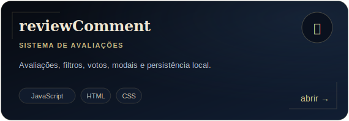
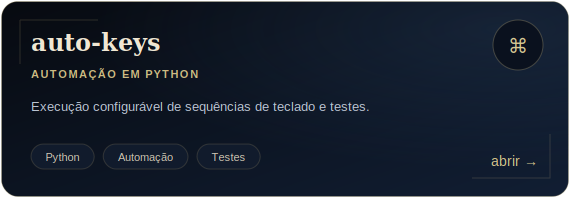
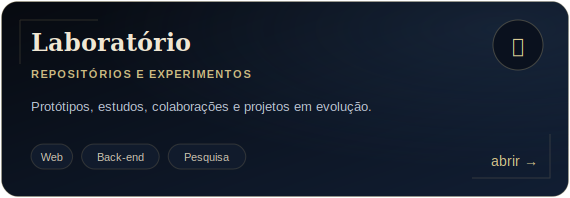

  

   

  
  

    

  
  
  

 

  <code>software · aplicações web · automações · integrações · experimentos</code>

## Arquivo de projetos

  
  

  

  <a href="https://github.com/Wr1856?tab=repositories">
    <strong>Entrar no arquivo completo →</strong>
  </a>

 

## Arsenal técnico

### Linguagens

### Frameworks e aplicações

### Dados e ferramentas

 

<table>
  <tr>
    <td width="33%" valign="top">
      <h3>Web</h3>
      Interfaces responsivas, componentes reutilizáveis e experiências digitais com identidade.
    </td>
    <td width="33%" valign="top">
      <h3>Back-end</h3>
      APIs, regras de negócio, integrações, persistência e organização de serviços.
    </td>
    <td width="33%" valign="top">
      <h3>Automação</h3>
      Scripts, testes, ferramentas internas e redução de processos repetitivos.
    </td>
  </tr>
</table>

## Registro de atividade

  
  

  As métricas representam apenas os repositórios públicos.

  

   

  <code>conceber · construir · testar · aprimorar</code>

    

  Informações profissionais, serviços e contato estão no
  <a href="https://wr1856.github.io"><strong>meu site</strong></a>.

