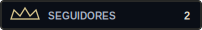
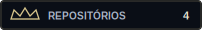
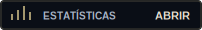
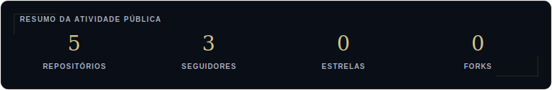

  

  <h1>Wesley Maia</h1>

  
<strong>Desenvolvedor e Especialista em Soluções Digitais</strong>

  

  

    Transformo complexidade em soluções digitais que funcionam, comunicam e crescem.
  

  
    I turn complexity into digital solutions that work, communicate, and grow.
  

 

<table align="center">
  <tr>
    <td align="center">
      <a href="https://wr1856.github.io">
         
        <strong>PORTFÓLIO</strong>
      </a>
    </td>
    <td align="center">
      <a href="https://github.com/Wr1856">
         
        <strong>GITHUB</strong>
      </a>
    </td>
    <td align="center">
      <a href="https://github.com/Wr1856?tab=repositories">
         
        <strong>REPOSITÓRIOS</strong>
      </a>
    </td>
    <td align="center">
      <a href="https://www.linkedin.com/in/wesleymaiarocha/">
         
        <strong>LINKEDIN</strong>
      </a>
    </td>
    <td align="center">
      <a href="mailto:wesley.mr2000@gmail.com">
         
        <strong>E-MAIL</strong>
      </a>
    </td>
    <td align="center">
      <a href="https://wa.link/81lr99">
         
        <strong>WHATSAPP</strong>
      </a>
    </td>
  </tr>
</table>

 

  

  

  

  

 

  
<strong>♛ Projetos em destaque / Featured projects</strong>

   

<!-- PROJECTS:START -->

  
<strong>♛ reviewComment</strong> — Sistema de avaliações / Review system

   

  **PT-BR**

  Interface responsiva para avaliações de produtos, com notas em estrelas, comentários, filtros, ordenação, votos e persistência local.

  **EN**

  Responsive product-review interface with star ratings, comments, filters, sorting, voting, and local persistence.

  **Stack**

  `JavaScript` · `HTML` · `CSS` · `LocalStorage`

  **Destaques / Highlights**

  - Sistema interativo de avaliações e comentários.
  - Filtros, ordenação e votos.
  - Interface responsiva e persistência no navegador.
  - Interactive review and comment system.
  - Filters, sorting, voting, and browser persistence.

  **Links**

  [Repositório / Repository](https://github.com/Wr1856/reviewComment)

 

  
<strong>♛ auto-keys</strong> — Automação em Python / Python automation

   

  **PT-BR**

  Ferramenta modular para automatizar sequências de teclado e reduzir tarefas repetitivas.

  **EN**

  Modular tool for automating keyboard sequences and reducing repetitive tasks.

  **Stack**

  `Python` · `Automação` · `Testes`

  **Destaques / Highlights**

  - Execução configurável de sequências.
  - Estrutura preparada para evolução e testes.
  - Configurable sequence execution.
  - Structure designed for extension and testing.

  **Links**

  [Repositório / Repository](https://github.com/Wr1856/auto-keys)

<!-- PROJECTS:END -->

   

  

    <a href="https://github.com/Wr1856?tab=repositories">
      <strong>Ver todos os repositórios / View all repositories →</strong>
    </a>
  

 

  
<strong>♛ Tecnologias, ferramentas e atividade / Technologies, tools & activity</strong>

   

  ### Stack principal / Core stack

  `JavaScript` · `TypeScript` · `C#` · `SQL` · `Node.js` · `.NET` · `React` · `Next.js`

  ### Tecnologias de apoio / Supporting technologies

  `Python` · `Angular` · `Vue.js` · `Tailwind CSS` · `MySQL` · `PostgreSQL` · `SQLite` · `Supabase`

  ### Ferramentas favoritas / Favorite tools

  `Git` · `GitHub` · `Docker` · `Linux` · `VS Code` · `Figma` · `Vercel`

  ### Áreas de atuação / Areas of practice

  - Desenvolvimento web e interfaces responsivas.
  - Back-end, APIs, integrações e bancos de dados.
  - Qualidade de software, testes e documentação.
  - Automação, suporte técnico e infraestrutura.
  - Web development and responsive interfaces.
  - Back-end, APIs, integrations, and databases.
  - Software quality, testing, and documentation.
  - Automation, technical support, and infrastructure.

  ### Próximos estudos / Learning next

  `IA aplicada` · `Machine Learning` · `Arquitetura de Software` · `Testes Automatizados` · `Cloud & DevOps`

   

  

    
  

 

  

   

  <em>
    “Aquele que tem um porquê para viver pode suportar quase qualquer como.”
  </em>

   

  Friedrich Nietzsche

